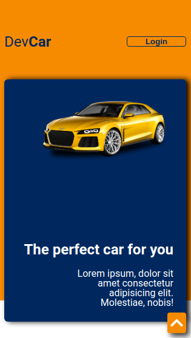
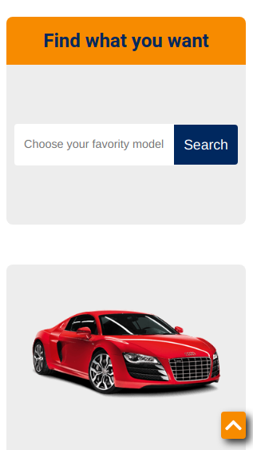
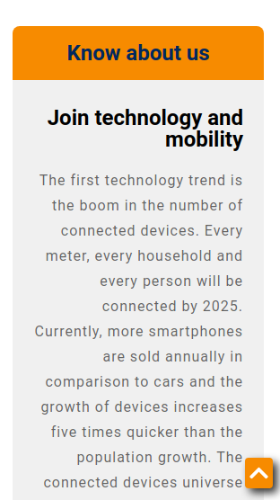
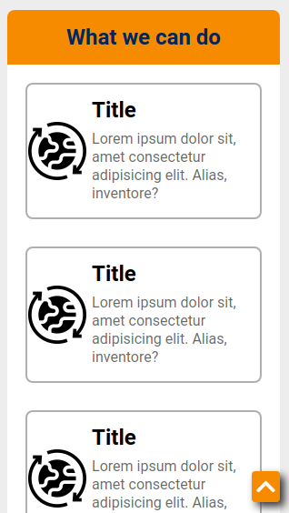
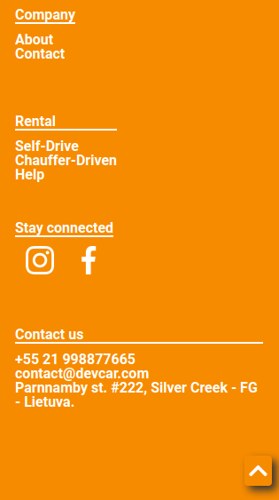
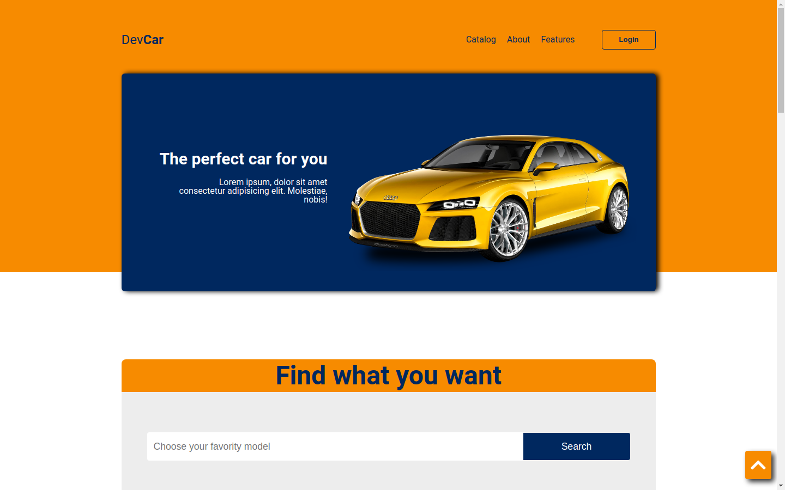
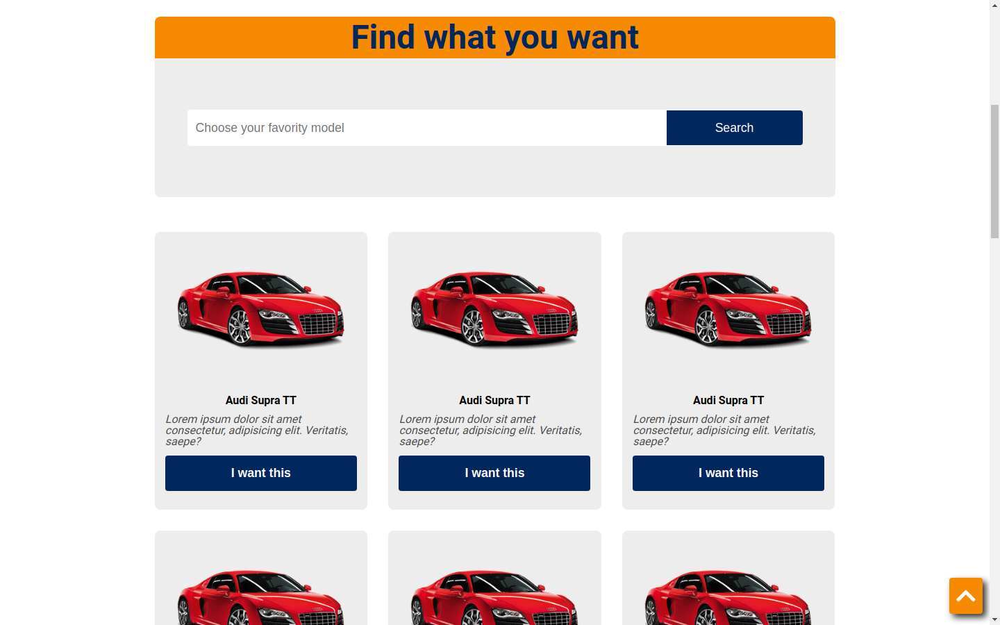
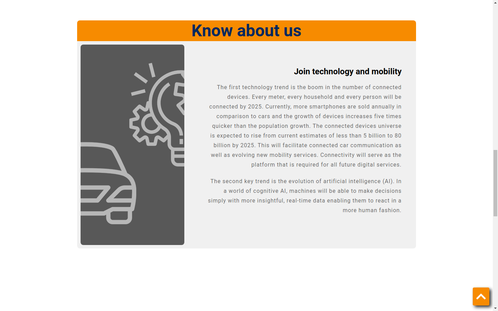
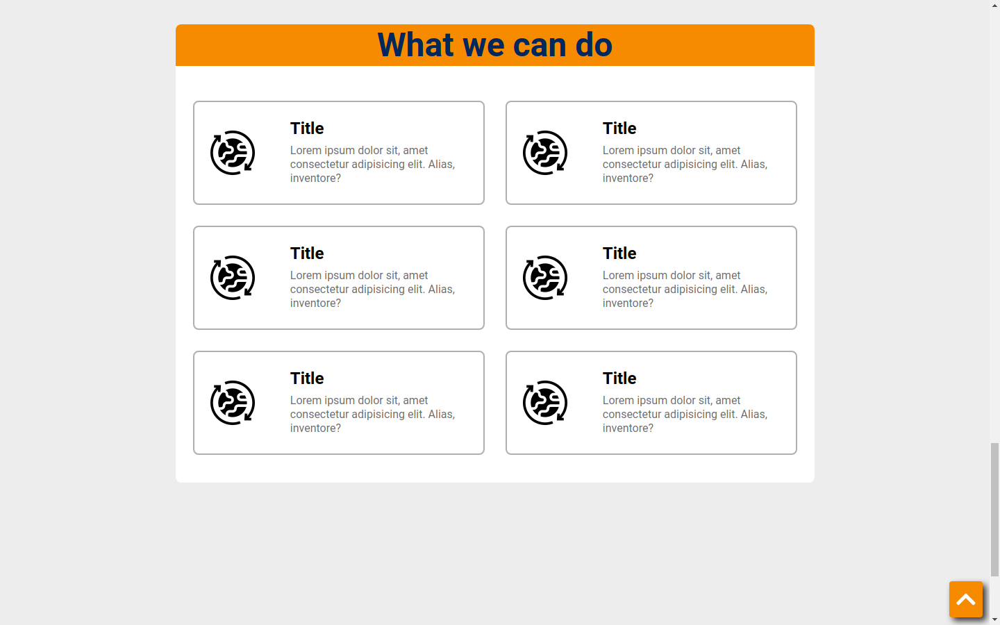
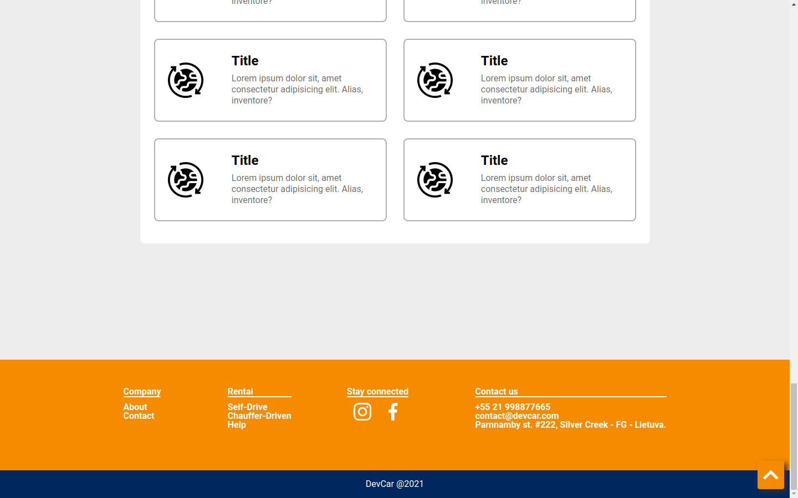

# DevCAr

# About The Project

https://devcar.netlify.app/

DevCar is a frontend project that was build with a youtube video at https://youtu.be/WzO5QlkjVLA.
The project show a model of a rental car website.

## Layout Mobile
       

 

      

 

 

## Layout Web

## Technologies

### HTML

Semantic HTML

### CSS

Style in elements, FlexBox layout, KeyFrames, Transition, Position.

### JS

Smooth scroll with JS using cferdinandi smooth-scroll CDN
https://github.com/cferdinandi/smooth-scroll

# Autor

Gilmar Ribeiro Santana
https://www.linkedin.com/in/gilmarribeirosantana/
